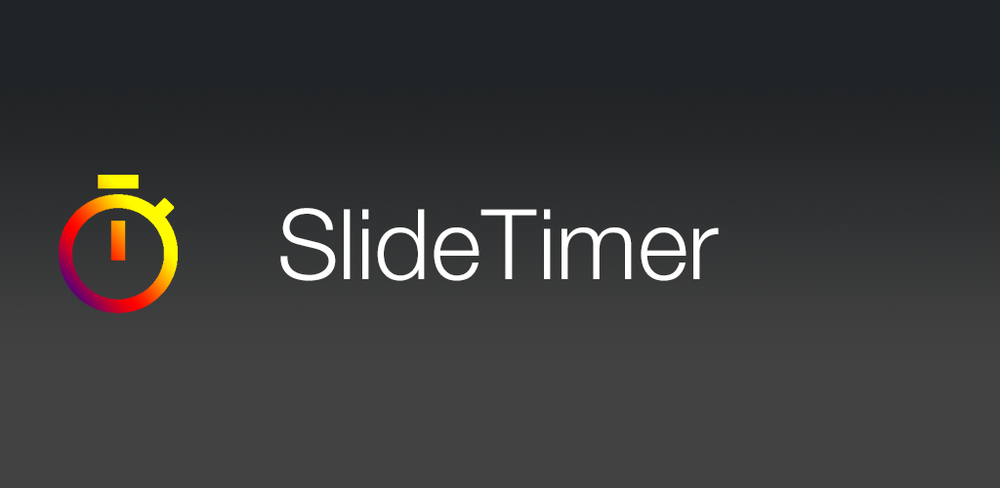
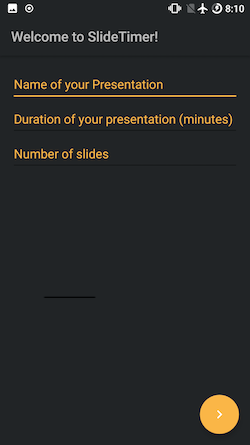
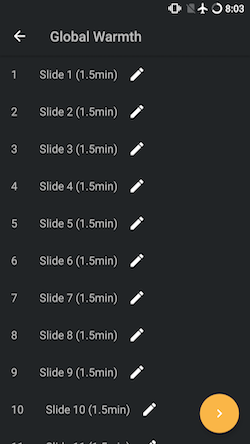
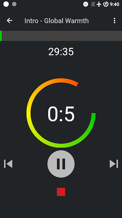

This app helps you to time your presentation slide by slide.
You can download it on the [Play Store](https://play.google.com/store/apps/details?id=com.slidetimer.oli.slidetimer).
  
 
 
After you entered your presentation's details you get a list to edit each slide individually.
When the slide perfect editing is done you can go to the presentation view and are ready to go.
On the top right are settings that determine when a notification should come.
