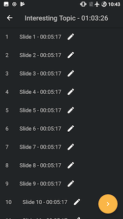

 
 

 
 

 SlideTimer helps you to time your presentation slide by slide.
 You can download it on the [Play Store](https://play.google.com/store/apps/details?id=com.slidetimer.oli.slidetimer).

# Features
After you entered your Presentation's Details you get a list to edit each Slide individually.
When the slide-perfect editing is done you can go to the Presentation view and are ready to go.
On the top right are Settings that determine when a notification should come.

# Version 2.0 released
Now the Time is displayed in a nice HH/MM/SS Layout throughout the App.
There are also NumberPickers to edit the Duration for each Slide even better.
Plus some minor changes.
